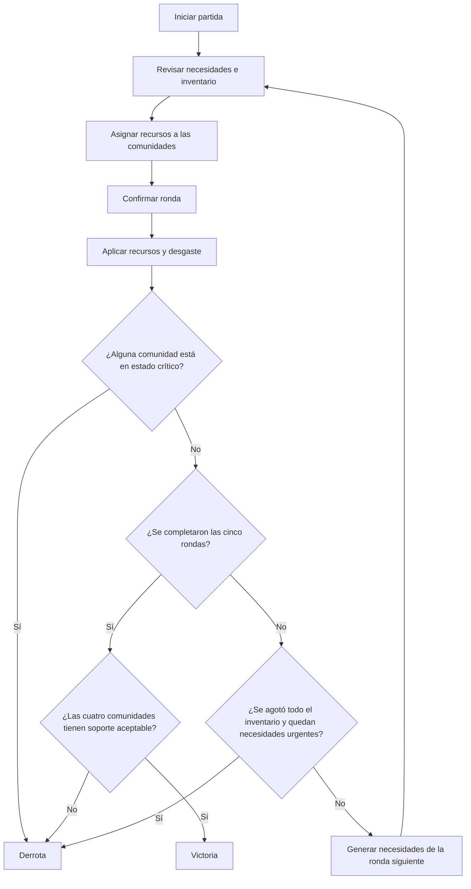

# Reparto Justo

> **Un simulador de distribución equitativa de recursos esenciales entre cuatro comunidades en situación de vulnerabilidad.**

Repartí recursos limitados, atendé necesidades variables y tratá de mantener a las cuatro comunidades con un nivel de soporte aceptable a lo largo de la simulación.

| Comunidades | Rondas | Recursos |
| ---: | ---: | --- |
| 4 | 5 | Agua · Comida · Medicina |

## Cómo jugar

1. Seleccioná **Iniciar reparto** para comenzar una partida.
2. Revisá el inventario, las necesidades y el nivel de soporte de cada comunidad.
3. Ajustá las cantidades con los botones **− / +** o con los campos numéricos.
4. Seleccioná **Confirmar ronda** para aplicar el reparto y avanzar.
5. Continuá hasta completar las cinco rondas o hasta que la partida termine.

Los controles se pueden utilizar con toque o con teclado. El botón **Reiniciar** inicia la simulación desde el principio.

## Objetivo y reglas

El objetivo es terminar la quinta ronda con las cuatro comunidades en estado **Aceptable**. La partida termina en derrota si una comunidad cae a estado **Crítico** o si se agota todo el inventario mientras quedan necesidades urgentes pendientes.

| Mecánica | Regla |
| --- | --- |
| Soporte inicial | 50 puntos por comunidad |
| Estado aceptable | 40 puntos o más |
| Estado crítico | Menos de 20 puntos |
| Efecto de cada unidad asignada | +10 puntos de soporte |
| Desgaste por ronda | −15 puntos de soporte por comunidad |
| Inventario inicial | 20 unidades de cada recurso |
| Necesidades iniciales | Distintas para cada comunidad |
| Necesidades de rondas siguientes | Entre 0 y 2 unidades por recurso y comunidad; se generan de forma reproducible con una semilla |

El soporte se limita al rango de 0 a 100 puntos. No se puede asignar más de lo que una comunidad necesita ni superar el inventario disponible.

### Recorrido de una partida



## Abrir la aplicación

Con el servidor de desarrollo iniciado, abrí [http://localhost:5173/](http://localhost:5173/).

## Instalación y comandos

Necesitás [Node.js](https://nodejs.org/) con npm. Desde una terminal, ubicáte en la carpeta del proyecto y ejecutá:

```sh
npm install
npm run dev
```

Comandos disponibles:

| Comando | Para qué sirve |
| --- | --- |
| `npm run dev` | Inicia el servidor local de desarrollo. |
| `npm test` | Ejecuta las pruebas automatizadas con Vitest. |
| `npm run build` | Verifica TypeScript y genera la compilación de producción en `dist/`. |
| `npm run preview` | Sirve localmente la compilación generada. Ejecutá primero `npm run build`. |

## Tecnologías

- **TypeScript** para el estado y las reglas del simulador.
- **Vite** para el servidor de desarrollo y la compilación.
- **Vitest** para las pruebas automatizadas.
- **HTML y CSS** para una interfaz adaptable, sin imágenes ni librerías visuales externas.

## Estructura del proyecto

```text
src/
├── logica.ts       # Estado, inventario, asignaciones y reglas de cada ronda
├── main.ts         # Presentación de las pantallas y manejo de controles
└── estilo.css      # Diseño visual y adaptación a pantallas pequeñas
test/
└── logica.test.ts  # Pruebas automatizadas de las reglas
index.html          # Documento de entrada de la aplicación
```

## Alcance

La partida se ejecuta en el navegador y no guarda datos en una base externa. No incluye mapas 3D, animaciones complejas ni partidas multijugador en tiempo real.

## Qué dirigí yo y qué error encontré probando

<!-- Completá este espacio con qué dirigiste vos y qué error encontraste al probar. -->

## Declaración de autoría

<!-- Completá este espacio con la herramienta que usaste, la declaración de que el código fue generado por un agente de IA bajo tu dirección y las partes que podés explicar. -->
